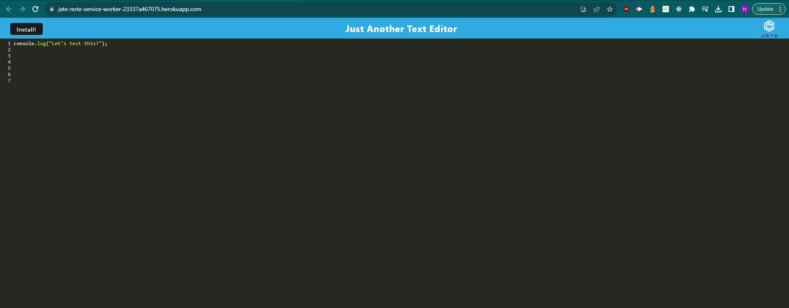
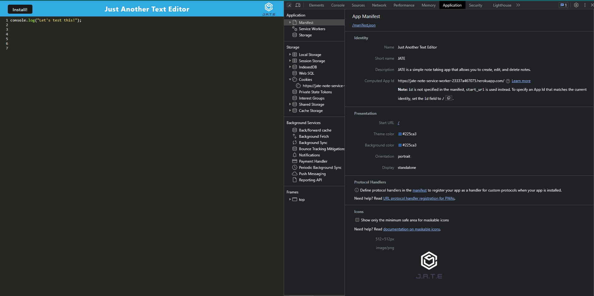
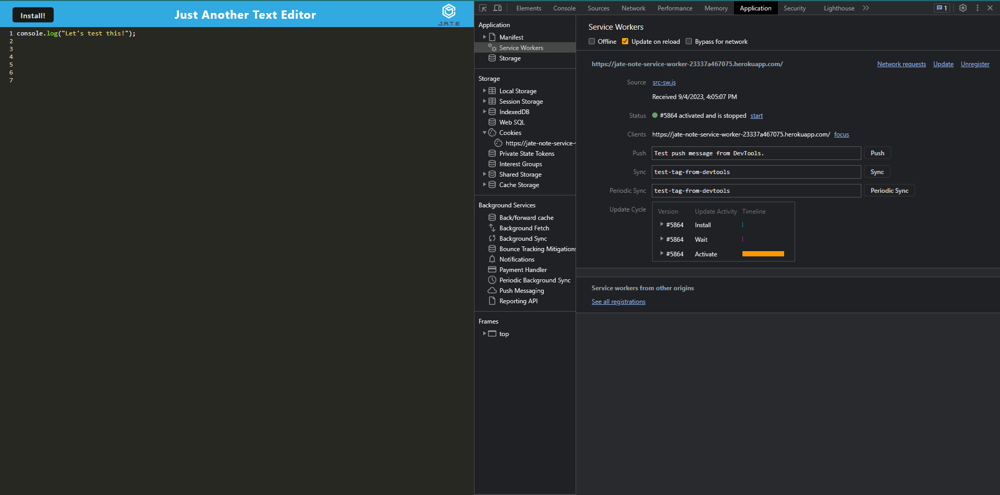
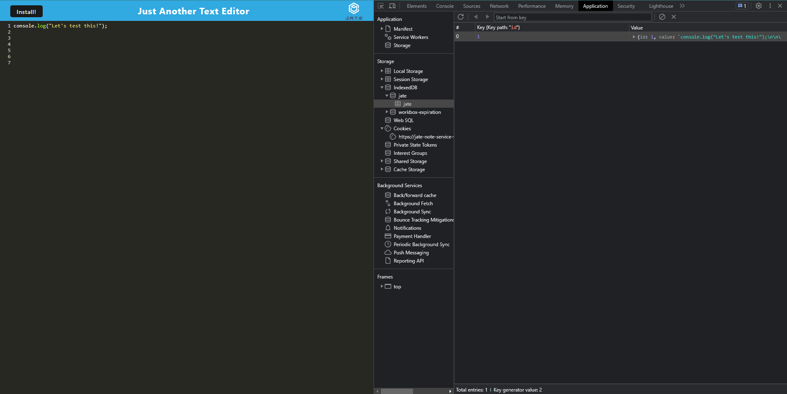

# 19 Progressive Web Applications (PWA): Text Editor


## Description

This is Progressive Web Application (PWA) for a Javascript based text editor. It is a single page application that uses various data persistence techniques that serve a redudancy in case an option is not supported by browser.
The app also functions offline with an install feature. Data is stored and retrieved through the IndexedDB database API through the idb package.

The app fits the needs of a user that wants to create notes or code snippets, either online/offline, so that they can be easily used later. When a user opens the editor, then the user should be able find that IndexedDB has immediately created database storage by checking with devtools. Wehen entering content and then clicking off the DOM window, the application saves the data with IndexedDB. When a user reopens the text editor after closing it, the content in the text editor persisest and is retrieved from the IndexedDB storage. Users can click the install button feature to download the web app as an icon on their desktop as well. When the web application loads, a registered service worker using workbox should exist. When a service worker is registered, then the static assets pre cached upon loading along with subsequent pages and static assets are there.

## Table of Contents

- [Installation](#installation)
- [Usage](#usage)
- [Contribution](#contribution)
- [Technologies](#technologies)
- [Questions](#questions)
- [License](#license)

## Installation

1. To install just clone this repo:

```
git clone git@github.com:hculp/readme-generator.git
```

2. Install all the associated packages in the package.json with npm:

```
npm i
```

3. To start the application run

```
npm run start
```

This will also build the client side dist folder that creates the bundled Javascript files with webpack that includes the generated HTML file, service worker, and manifest file.

## Usage

Once the application is installed and running, enter some code text first the test the application in running properly, and check the browser devtools simiarily done here to ensure all features work or if any modifications are needed to meet specifications.

> 
> This image is an example that shows the application's manifest.json file.
> 
> This image is an example that shows the application's registered service worker.
> 
> This image is an example that shows the IndexedDB storage.
> 

Test the live application site on Heroku [here](https://jate-note-service-worker-23337a467075.herokuapp.com/).

## Contribution

Contribution falls under open MIT license.

## Technologies

The main packages used to run this application are:

- Babel
- Webpack and Workbox associated utilities
- Express.js
- NodeJS
- IndexedDB
- Code mirror themes

## Questions

Send any questions or feedback to the following contacts:

- GitHub: [https://github.com/hculp](https://github.com/hculp)
- Email: [howacul@gmail.com](mailto:howacul@gmail.com)

## License

    Copyright (C) 2023 Houston Culpepper.

    Distributed under the MIT License.

[Link to MIT license](https://choosealicense.com/licenses/mit)
